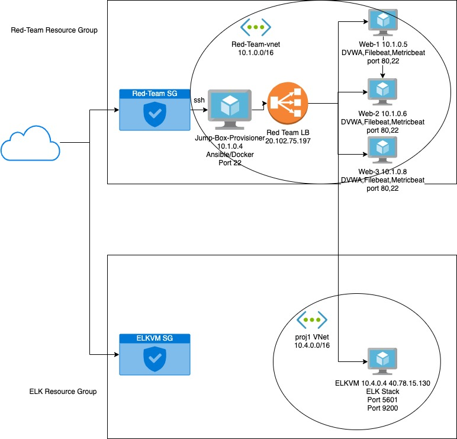

# cyberxsecurity

## Automated ELK Stack Deployment

The files in this repository were used to configure the network depicted below.

These files have been tested and used to generate a live ELK deployment on Azure. They can be used to either recreate the entire deployment pictured above. Alternatively, select portions of the playbook file may be used to install only certain pieces of it, such as Filebeat.

 -ELK
 -DVWA
 -Filebeat
 -Metricbeat

This document contains the following details:
- Description of the Topologu
- Access Policies
- ELK Configuration
  - Beats in Use
  - Machines Being Monitored
- How to Use the Ansible Build

### Description of the Topology

The main purpose of this network is to expose a load-balanced and monitored instance of DVWA, the D*mn Vulnerable Web Application.

Load balancing ensures that the application will be highly available, in addition to restricting access to the network.
- A jumpbox is a server that serves as a gateway into the remote network.
- A loadbalancer is to serve as a point of access to service multiple machines

Integrating an ELK server allows users to easily monitor the vulnerable VMs for changes to the log files and system resources.
- Filebeat watches for system logs
- Metricbeat is used for gathering metrics and system usage

The configuration details of each machine may be found below.

| Name     | Function   | IP Address | Operating System |
|----------|------------|------------|------------------|
| Jump Box | Gateway    | 10.1.0.4   | Ubuntu           |
| Web 1    | Web Server | 10.1.0.5   | Ubuntu           |
| Web 2    | Web Server | 10.1.0.6   | Ubuntu           |
| Web 3    | Web Server | 10.1.0.8   | Ubuntu           |
| ELKVM    | ELK Server | 10.4.0.4   | Ubuntu           |
### Access Policies

The machines on the internal network are not exposed to the public Internet.

Only the jumpbox machine can accept connections from the Internet. Access to this machine is only allowed from the following IP addresses:
- 75.139.135.231

Machines within the network can only be accessed by the jumpbox.
- jumpbox
  public ip: 52.168.141.189
  private ip: 10.1.0.4
A summary of the access policies in place can be found in the table below.

| Name      | Publicly Accessible | Allowed IP Addresses        |
|-----------|---------------------|-----------------------------|
| Jump Box  | Yes ssh(22)         | 75.139.135.231              |
| Web 1,2,3 | No                  | 20.102.75.197 (Red-Team-LB) |
| Web LB    | Yes http(80)        | all                         |
| ELK       | yes Kibana(5601)    | all                         |
| ELK       | yes http api(9200)  | 10.1.0.0/16                 |

### Elk Configuration

Ansible was used to automate configuration of the ELK machine. No configuration was performed manually, which is advantageous because...
- It reduces configuration errors and full automation for selected servers

The playbook implements the following tasks:
- Install docker: install docker to remote server
- Install Python3_pip: allows additional docker modules to be installed easier
- Docker Module: Install necessary modules
- Increase Memory: ELK Docker image requires more memory to allow the server to launch
- Download and launch ELK: Downloads ELK container and initializes it

The following screenshot displays the result of running `docker ps` after successfully configuring the ELK instance.

### Target Machines & Beats
This ELK server is configured to monitor the following machines:
- 10.1.0.5
- 10.1.0.6
- 10.1.0.8
- 10.4.0.4

We have installed the following Beats on these machines:
- Web 1
- Web 2
- Web 3
- ELKVM

These Beats allow us to collect the following information from each machine:
- Filebeats collects system events such as logins and commands and see what command is being used. Metricbeats collects information such as cpu usage and memory, it is useful to see what is taking up the systems resources

### Using the Playbook
In order to use the playbook, you will need to have an Ansible control node already configured. Assuming you have such a control node provisioned:

SSH into the control node and follow the steps below:
- Copy the install-elk.yml file to /etc/ansible/install-elk.yml
- Update the hots file to include the attribute and the destination IP of the ELK server
- Run the playbook, and navigate to /etc/ansible/install-elk.yml to check that the installation worked as expected.

- _Which URL do you navigate to in order to check that the ELK server is running?
http://[elk_server_ip]:5601/app/kibana/

_As a **Bonus**, provide the specific commands the user will need to run to download the playbook, update the files, etc._

- Log on to the jumpbox and run the curl commands to get the playbook to install elk

- Edit the hosts file in etc/ansible and update the ip addresses(make sure you are connected to the container)

- Run the Playbook : ansible-playbook /etc/ansible/roles/elk_install.yml

- Check that elk is installed by visiting to http://[elk_server_ip]:5601/app/kibana/

